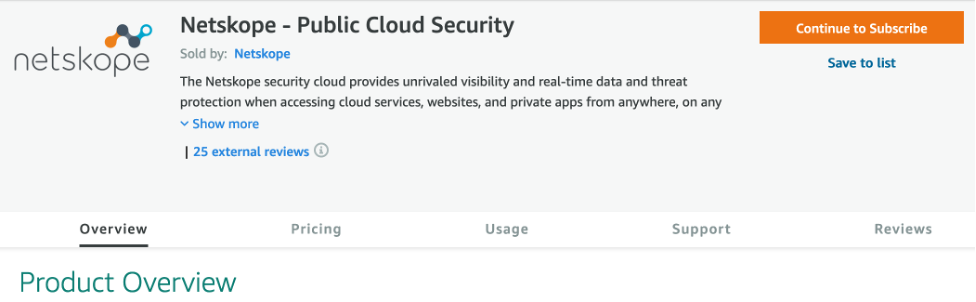
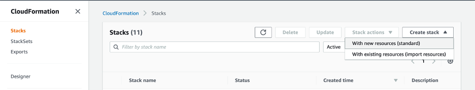
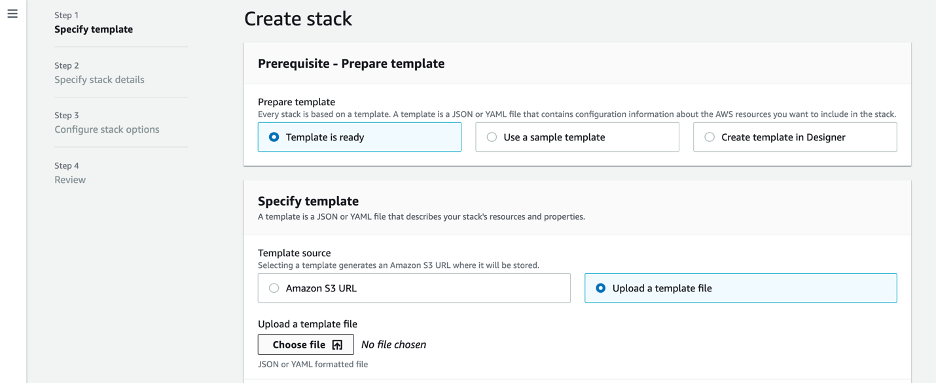

In this document we'll show you how you can enroll your organization's
AWS accounts, governed by the [AWS Control
Tower](https://aws.amazon.com/controltower/?control-blogs.sort-by=item.additionalFields.createdDate&control-blogs.sort-order=desc),
into the [Netskope Cloud Security Posture Management (CSPM) and Storage
Scan storage
services](https://www.netskope.com/products/public-cloud-security).

AWS Control Tower provides the easiest way to set up and govern a
secure, multi-account AWS environment and to implement AWS best security
practices.

Netskope CSPM enables you to gain the visibility and control across the
AWS accounts in multi-account environment to secure your data,
applications and services, maintain best practices and standards
compliance as well as to automate your incident response.

Netskope Storage Scan services allows AWS customers to easily identify
and protect sensitive data on the organization's S3 buckets as well as
detect malware.

With this easy, one-click integration between AWS Control Tower and
Netskope CSPM and Storage Scan services you can automatically enroll
your existing AWS Organization's accounts into Netskope CSPM and Storage
Scan services, as well assure that new accounts provisioned by the AWS
Control Tower account factory will be also immediately protected by the
Netskope Security Cloud services.

## Prerequisites.

The following are the prerequisites for the solution described in this
article:

1.  [AWS Control Tower Landing
    Zone](https://aws.amazon.com/controltower/features/) established
    with AWS Control Tower.

2.  [Customizations for AWS Control Tower](https://aws.amazon.com/solutions/implementations/customizations-for-aws-control-tower/) solution deployed in your landing zone environment. This solution allows you to customize the AWS Control Tower landing zone according to your organization's requirements and to ensure that your AWS resource deployments stay in sync with your landing zone. 

3.  Existing Netskope Security Cloud tenant that you'll be using to secure your AWS Control Tower landing zone environment. 

## Components and considerations. 

The solution source code can be found on [GitHub](https://github.com/netskopeoss/Netskope-CSPM-StorageScan-AWSControlTower). This GitHub repository contains two AWS CloudFormation templates and the manifest file. The first template, Netskope-CSPM-StorageScan-Account-Enrolment-ControlTower.yaml shall be deployed in the same AWS account and Region where your Control Tower landing zone and the [Customizations for AWS Control Tower](https://docs.aws.amazon.com/solutions/latest/customizations-for-aws-control-tower/considerations.html) solution are deployed. You need to deploy the solution only on that account and only in that AWS Region. During the AWS account enrolment Netskope orchestration will provision appropriate cross-account AWS IAM roles in all the regions you opted in for. 

The CloudFormation stack deployed using this template on the Control
Tower landing zone account creates the following resources on that
account:

a.  AWS Secrets Manager secret encrypted by AWS Key Manager Service key
    to store your Netskope API access token.

b.  Amazon CloudWatch event rule triggered by the SUCCEEDED status event
    from the Customizations for AWS Control tower' [AWS Step
    Functions](https://docs.aws.amazon.com/solutions/latest/customizations-for-aws-control-tower/architecture.html).

c.  AWS NetskopeAutoAddInstanceLambda Lambda function invoked by the
    CloudWatch event rule above. Upon receiving a SUCCEEDED event from
    the Customizations for AWS Control Tower for Netskope accounts
    enrollment, this Lambda function calls the Netskope [Get Instance
    Info](https://docs.netskope.com/en/get-instance-info.html), [Create
    an AWS
    Instance](https://docs.netskope.com/en/create-an-aws-instance.html)
    and [Update an AWS
    Instance](https://docs.netskope.com/en/update-an-aws-instance.html)
    APIs to create or update the AWS account enrolment in your Netskope
    tenant.

Note: You must deploy this template on your landing zone management
account prior to proceeding with the Customizations for AWS Control
Tower using the second AWS CloudFormation template and the customization
manifest file.

You will use the manifest.yaml file for Customizations for AWS Control
Tower solution to deploy the cross-account IAM role will be used by
Netskope. This example of the manifest file describes the AWS accounts
and Organization Units (OUs) which you'd like to automatically enroll
into Netskope Security Cloud. It points to the
NetskopeCSPM-StorageScan-RoleTemplate-ControlTower.yaml AWS
CloudFormation template for resources to be deployed on the target
accounts. This template is available for you on the Netskope Amazon S3
buckets in all major AWS regions. When you trigger the Customizations
for AWS Control Tower code pipeline, the customization solution
deploys [[AWS CloudFormation
StackSets]{.underline}](https://docs.aws.amazon.com/AWSCloudFormation/latest/UserGuide/what-is-cfnstacksets.html) with
the resources defined in the
NetskopeCSPM-StorageScan-RoleTemplate-ControlTower.yaml template across
the accounts and OUs defined in the manifest file.

Later, when you create a new managed account using [[AWS Control Tower
Account
Factory]{.underline}](https://docs.aws.amazon.com/controltower/latest/userguide/account-factory.html),
the customization solution uses the [[AWS Control Tower Lifecycle
Event]{.underline}](https://docs.aws.amazon.com/controltower/latest/userguide/lifecycle-events.html) to
invoke the same CodePipeline workflow and deploys the AWS IAM roles will
be used by Netskope on the newly created account. When the
Customizations for AWS Control tower solution finished the Netskope AWS
IAM role deployment, the Customization solution Step Functions send the
SUCCEEDED event in the Amazon CloudWatch which triggers the
NetskopeAutoAddInstanceLambda Lambda function which configures your AWS
account in the Netskope tenant.

You can find more information about Customizations for AWS Control Tower [here](https://aws.amazon.com/solutions/implementations/customizations-for-aws-control-tower/).

Please also refer to the [Customizations for AWS Control Tower Develop Guide](https://s3.amazonaws.com/solutions-reference/customizations-for-aws-control-tower/latest/customizations-for-aws-control-tower-developer-guide.pdf) for more details.

To learn more about the Customizations for AWS Control Tower you also can take a look at the [Customizations for AWS Control Tower hand-on lab](https://controltower.aws-management.tools/automation/cfct/) in the [Control Tower immersion day](https://controltower.aws-management.tools/immersionday/). 

## Deployment steps:

1.  Deploy the AWS CloudFormation stack in your AWS Control Tower Landing Zone management account using the Netskope-CSPM-StorageScan-Account-Enrolment-ControlTower.yaml template. 

1.  Clone this GitHub repository to your machine:

git clone 
[https://github.com/netskopeoss/Netskope-CSPM-StorageScan-AWSControlTower.git](https://github.com/dyuriaws/Netskope-TGW-management.git)

2.  Sign into the AWS CloudFormation management console and change the region to the one your AWS Control Tower landing zone and the Customizations for AWS Control Tower solution are deployed. 

3.  Click Create Stack and choose With new resources (standard).

{: width="6.5in" height="1.2381944444444444in"}

4.  Choose Upload a template file and click on Choose file.

{: width="6.5in"
height="2.660416666666667in"}

5.  Choose the Netskope-CSPM-StorageScan-Account-Enrolment-ControlTower.yaml from
    the disk, click Open and then click Next.

{: width="5.968253499562555in"
 height="3.1824311023622047in"}

6.  Enter the stack name and the parameters for your deployment:

+-----------------------+----------------------------------------------+
| Netskope tenant FQDN  | Enter Netskope tenant FQDN                   |
|                       | (f.e.example.goskope.com)                    |
+=======================+==============================================+
| Netskope tenant REST  | Enter Netskope tenant                        |
| API token             | REST API token provided by Netskope          |
+-----------------------+----------------------------------------------+
| Netskope AWS Account  | Enter Netskope trusted AWS Account ID        |
| ID                    | provided by Netskope                         |
+-----------------------+----------------------------------------------+
| STS external ID       | Enter STS external ID provided by Netskope   |
+-----------------------+----------------------------------------------+
| AWS PrincipalOrgID    | Enter your AWS Organizations ID (f.e.        |
|                       | o-12345678)                                  |
|                       |                                              |
|                       | The solution will use the AWS Organizations  |
|                       | ID to retrieve the AWS Account Name to       |
|                       | provision it in the Netskope tenant          |
+-----------------------+----------------------------------------------+
| Security              | Enter your Security Administrator email      |
| Administrator email   | address                                      |
| address               |                                              |
+-----------------------+----------------------------------------------+
| AWS KMS Key ID        | Optional KMS Key ID to encrypt Netskope API  |
|                       | token in Secrets Manager. If not specified   |
|                       | aws/secretsmanager will be used              |
+-----------------------+----------------------------------------------+
| Security Scan enabled | Enter ( \"true\", \"false\" ), whether       |
|                       | Netskope CSPM Security violations Scan is    |
|                       | enabled                                      |
+-----------------------+----------------------------------------------+
| CSPM security scan    | Choose the CSPM security and compliance      |
| interval              | violations scan interval in minutes          |
+-----------------------+----------------------------------------------+
| DLP Scan enabled      | Enter ( \"true\", \"false\" ), whether       |
|                       | Netskope storage DLP Scan is enabled         |
+-----------------------+----------------------------------------------+
| MalwareScan Scan      | Enter ( \"true\", \"false\" ), whether       |
| enabled               | Netskope storage Malware Scan is enabled     |
+-----------------------+----------------------------------------------+

{: width="5.634235564304462in"
height="6.503449256342957in"}

7.  Click Next.

8.  Optionally, enter the Tags for your CloudFormation stack and / or
    click Next.

 {: width="5.491870078740157in"
 height="4.133570647419073in"}

9.  Acknowledge creating IAM resources and click Create stack.

 {: width="5.313136482939632in"
 height="3.058459098862642in"}

10. When CloudFormation stack is in the CREATE_COMPLETE state, you can
    navigate to the Resources tab and see the resources created by the
    stack.

{: width="5.986206255468066in"
 height="2.2224431321084865in"}

11. Later, after you deploy the AWS IAM cross-account roles used by
    Netskope using the Customizations for AWS Control Tower, you can
    monitor the NetskopeAutoAddInstanceLambda Lambda function execution
    logs by opening AWS CloudWatch management console, navigating to
    Logs -\> Log groups menu and choosing the log group for your Lambda
    function.

{: width="6.5in"
height="2.084722222222222in"}

2.  # Deploy the AWS IAM cross-account roles using the Customizations for AWS Control Tower.

    1.  Open the manifest.yaml file you cloned from the GitHub repository. 

    2.  Replace the us-east-2 AWS Region in the lines 4, 11 and 34 with the AWS Region where your Control Tower landing zone is deployed. 

    3.  Replace the TrustedAccountID and the ExternalID with the corresponding values for you Netskope tenant. 

To find the TrustedAccountID and the ExternalID please follow the steps below:

1.   Sign into the Netskope tenant management console and navigate to Settings \> API-enabled Protection \> IaaS, then select AWS and click Setup.

2.   In the New Setup window, enter the 12 digits of any of your AWS accounts ID, followed by the account name. Follow the format as described in the text box. Keep the default service checked and click Next.

 {: width="4.362069116360455in"
 height="3.0534481627296586in"}

 Download the CFT file and close the New Setup - Amazon Web Services {: width="5.140900043744532in" height="3.1674759405074364in"}window. 

# 

 Open the CoudFormation template file you just downloaded and look for the AWS IAM policy statement similar to this one:

 Statement:

  - Action:
  - sts:AssumeRole
  Condition:
  StringEquals:
  sts:ExternalId:01234567890abcdef01234567890abcdef0123456
  Effect: Allow
  Principal:
  AWS:
  - arn:aws:iam::123456789012:root
  Sid: \'\'

The value of sts:ExternalId is your ExternalID and the account ID in the
AWS account ARN is your TrustedAccountID

4.   Set the values for the SecurityScan, DLPScan and TrustedAccountID to true or false to configure the Netskope Security Cloud functionality you'd like to use to protect your AWS accounts. 

5.   Configure the AWS Organizations Units and accounts you'd like to enroll in Netskope CSPM and Storage Scan services in the deployment_targets section of the manifest file. Please refer to the [Customizations for AWS Control Tower Develop Guide](https://s3.amazonaws.com/solutions-reference/customizations-for-aws-control-tower/latest/customizations-for-aws-control-tower-developer-guide.pdf) for more details about working with the manifest file.

6.   Save the manifest file.

 Now you can trigger the Customizations for AWS Control Tower code pipeline using the newly edited manifest file. 

Below we assume you're using AWS
[CodeCommit](https://aws.amazon.com/codecommit/) as the Customizations
for AWS Control Tower CodePipeline source.

You can also use Amazon S3 as your configuration source as described in
[this
Documentation](https://docs.aws.amazon.com/solutions/latest/customizations-for-aws-control-tower/appendix-a.html).
Steps for deploying the Control Tower customizations for Netskope
account enrollment using Amazon S3 as a configurations source are
similar to the steps using AWS CodeCommit below.

 Sign into the AWS CodeCommit management console, choose the custom-control-tower-configuration repository and copy its HTTPS (GRC) URL:

 {: width="5.879311023622047in" height="1.180259186351706in"}

 If not yet installed, install the git-remote-codecommit package in your local machine:

pip install git-remote-codecommit

# 

 Assuming you already have proper AWS CLI credentials for accessing the control-tower-configuration repository in your Control Tower landing zone management account, clone this repository to your local machine:

git clone (HTTPS (GRC) URL copied above)

 Replace the manifest.yaml file in the cloned repository by the one you edited above. 

cd control-tower-configuration

cp \<new manifest.yaml file>

# 

 Check in the manifest file with the customizations for Netskope cross-accounts AWS IAM roles deployment into the CodeCommit repository:

git status git add -A

git commit -m 'Netskope Automatic Accounts enrollment'

git push

 You can check the progress of deploying Netskope cross-account AWS IAM roles on the CodePipeline. 

12.  Navigate to [AWS CodePipeline Console](https://console.aws.amazon.com/codepipeline/) on your Management account.

13.  Choose Custom-Control-Tower-CodePipeline to track the status of the pipeline at various stages.

14.  When the last stage of the Netskope customization will be complete, open the Netskope tenant management console, navigate to Settings \> API-enabled Protection \> IaaS and check that your existing AWS accounts configured in the manifest file successfully enrolled in the Netskope CSPM and Storage Scan services. 

 Now, when you provision a new AWS account using AWS Control Tower account factory, the solution will automatically enroll that account in the Netskope CSPM and Storage Scan services if this account belongs to the one of the AWS Organization's Units previously provisioned in the manifest file.

 You've just seen how you can automatically enroll your existing AWS accounts, managed by the AWS Control Tower, as well as new AWS account provisioned with AWS Control Tower account factory into the Netskope Cloud Security Posture Management and Storage DLP and malware scan. 

 
